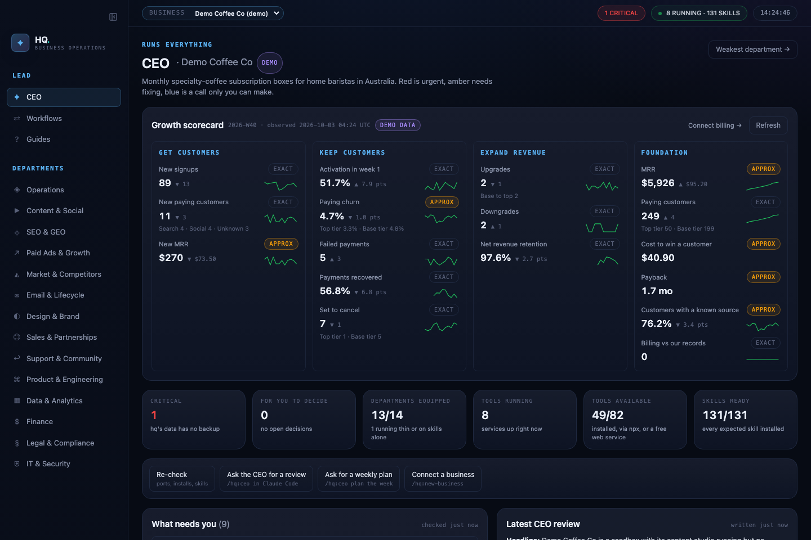
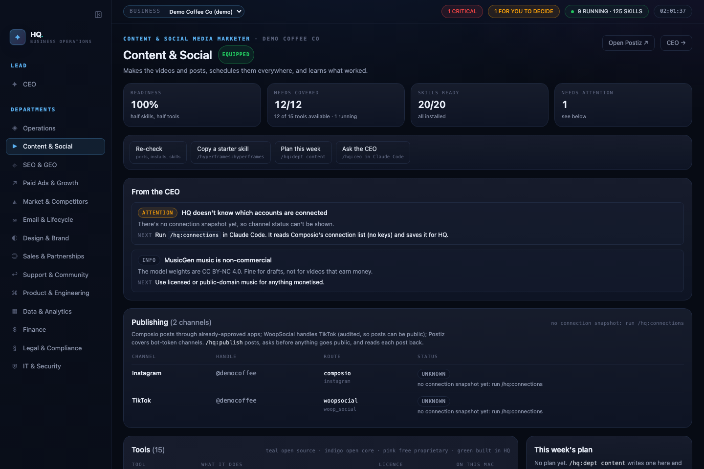
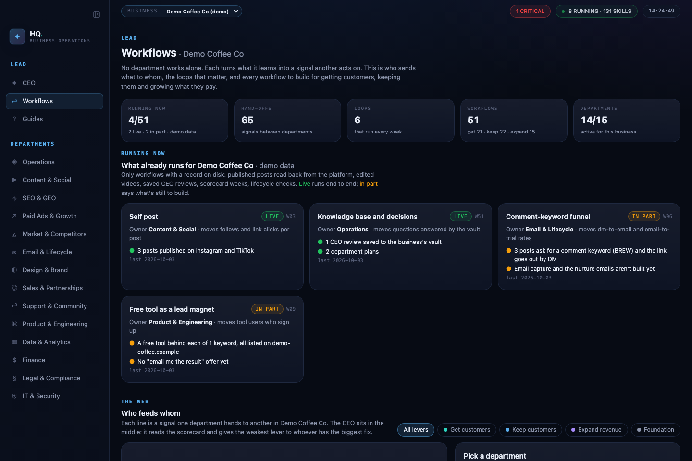

# HQ

Run any business from one local console. Every business function gets a tab, staffed with **free
tools** (open source first) and **Claude skills**. A **CEO** reads it all, ranks what needs doing,
asks you for at most five decisions and delegates the rest. Each business keeps its memory in its
own **Obsidian vault**.







## Set up on a Mac

```bash
gh repo clone jameselle/hq-os ~/business-os && cd ~/business-os
npm install && npm run build
claude plugin marketplace add jameselle/hq-os && claude plugin install hq@hq
npm run hq -- services init && npm run hq -- services install   # starts at login
```

Open http://127.0.0.1:3150. In Claude Code, run `/hq:new-business` to connect a business, then **`/hq:setup`**:
it walks you through backups and every department, one step at a time, from the guides in the **Guides** tab
(`docs/guides/`). Start with [Getting started](docs/guides/start-here.md).

## Everyday use

| Want to… | Do |
|---|---|
| Get walked through setting HQ up, or one department | `/hq:setup` (or open the Guides tab) |
| See what needs you | Open the CEO tab |
| Get a review and a plan for the week | `/hq:ceo` |
| Plan one department's week | `/hq:dept content` (or seo, finance, …) |
| Connect another business | `/hq:new-business` |
| Add a tool to a department | `/hq:add-tool` |
| Check backups, or back up now | `/hq:backup` |
| Recover something | `/hq:restore` |
| See or connect posting accounts | `/hq:connections` |
| Post to channels | `/hq:publish` |
| What's winning in your niche → topics, hooks, edit style, pace targets | `/hq:style` |
| Your own post: script → teleprompter → Claude edits → post | `/hq:self-post` |
| Long video → short clips | `/hq:clip` |
| Footage + brief → finished video | `/hq:edit` |
| "How it works" videos of your app, in your own cloned voice | `/hq:walkthrough` |
| Watch competitors, weekly brief | `/hq:competitors` (`setup` first) |
| See what's running | `/hq:services` or `npm run hq -- services status` |
| Connect Stripe, the App Store or your own database to the scorecard | `/hq:scorecard` |
| Health check | `npm run hq -- doctor` |

## The brain

Every business has its own Obsidian vault, and there's one shared **HQ brain** for what's true across
all of them. Both hold the same five kinds of note: facts, decisions, lessons, playbooks and signals.
Each department reads the right ones before it works (`npm run hq -- brain read <slug> <dept>`) and
writes what it learned after; the Workflows page draws who reads and writes what. A lesson moves up to
the HQ brain only when the CEO proposes it and you say yes, rewritten so it names no business. See
[the brain guide](docs/guides/brain.md).

## How publishing works

Each channel in a business profile posts through a **route**. The route defaults per platform, and a profile can override it with `via`:

| Platform | Default route | Why |
|---|---|---|
| Instagram, YouTube, Pinterest, Facebook, LinkedIn, X | **Composio** | already-approved apps, so no developer apps or platform review of your own |
| TikTok | **WoopSocial** (via Composio's `woop_social` toolkit) | an audited TikTok partner, so posts can be public |
| Discord, Telegram, Reddit, Bluesky, Mastodon, Threads | **Postiz** | bot tokens, self-hosted calendar |
| anything else | manual | |

- **Automatic replies** (comment-to-DM, keyword replies) run in **ManyChat**, connected inside ManyChat itself. Its free plan covers 25 active contacts a month and 3 keyword triggers. `/ig-dm` and `/ig-reply` write the scripts.
- `/hq:connections` saves a snapshot of what's connected (ids and statuses only, never keys) and connects new accounts when you ask.
- `/hq:publish` does a dry run, asks you, posts, reads the post back, and logs it.

A channel only counts as connected when a connected account's name matches its handle, or when the profile pins it with `"account"`. HQ never assumes another business's account is this one's.

## HQ Studio: automatic clipping and editing

No hand editing. `/hq:clip` and `/hq:edit` write an edit description (`spec.json`), and `npm run studio -- render` does the rest:
- whisper.cpp word timestamps
- pauses cut from the real audio
- reframing to 9:16, 1:1 or 16:9
- burned-in captions and a hook title
- music ducked under the voice, levelled to −14 LUFS

`npm run studio -- check` then QAs every output: format, loudness, black frames, dead air, the opening words, and whether every kept word is still heard. It also makes a contact sheet the skill must look at before handing over. The owner only approves publishing.

## Where things live

| What | Where | Backed up by |
|---|---|---|
| The framework (this repo) | `~/business-os` | GitHub (private) |
| Businesses: profiles, reviews, plans, vaults | `~/hq-data` | restic, nightly, encrypted, in iCloud Drive |
| The shared HQ brain (Obsidian vault) | `~/hq-data/brain` | the same restic backup |
| Backup password | login Keychain, `hq-restic` | **you**: copy it into your password manager |
| Services | `~/Library/LaunchAgents/com.hq.*` | regenerated from `~/hq-data/services.json` |
| Tool data: Listmonk (Postgres), Uptime Kuma, Syncthing config | `~/.local/var/…` | services with a `backup` spec in `services.json` (a Postgres cold copy or a SQLite copy) are staged into the nightly restic backup; other configs are reproducible |

## Local tools (all bind to 127.0.0.1)

| Tool | Where | Department |
|---|---|---|
| Fava (every business's books) | http://localhost:5055 | Finance |
| Listmonk (newsletters; create the admin on first visit) | http://localhost:9000 | Email |
| Uptime Kuma (site monitoring) | http://localhost:3001 | Engineering |
| Syncthing (sync between Macs) | http://localhost:8384 | IT & Security |
| changedetection.io (competitor page watcher; API token in Keychain) | http://localhost:5010 | Market & Competitors |
| Postiz / Temporal UI | http://localhost:4200 · :8233 | Content |

Alternatives are grouped (a department needs one CRM, not all of them), and "optional" tools never count against readiness.

## Reusing it

The framework knows nothing about any particular business. A business is a `profile.json`
(offer, audience, channels, country, regulated industries, departments it skips) plus a vault.
Connect as many as you like; switch between them in the top bar.

## Licence

MIT: free to use, change and share. See [LICENSE](LICENSE). HQ is built in public; issues and pull
requests are welcome.
